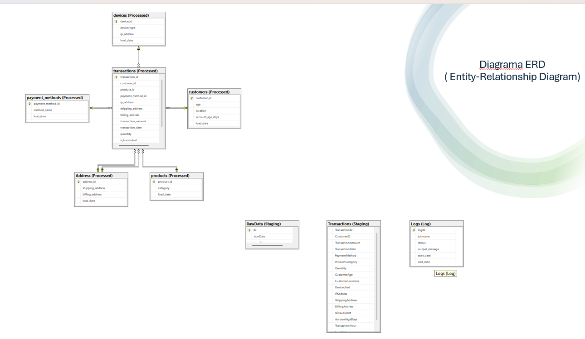

# Fraudulence Ecommerce Database Analysis

**Author:** Maria Păduraru  
**Course:** SQL Complete, Group 1

## 📌 Project Overview
This project implements a complete SQL data pipeline designed to process, normalize, and analyze e-commerce transactions with a focus on **fraud detection**. The system handles the entire data lifecycle: from ingesting raw data (JSON format) to advanced analysis through views and auditing via triggers.

## 🏗️ Database Architecture (ERD)
The database is organized into several schemas (**Staging**, **Processed**, **Log**) to ensure data integrity and separation of concerns. The diagram below illustrates the relationships between core entities like transactions, customers, and devices.

## 🛠️ Technical Implementation

### 1. Data Ingestion (ETL)
I implemented a structured **SQL Agent Job** with two main steps:
* **Step 1:** Create the `staging.RawData` table to hold the bulk JSON content.
* **Step 2:** Parse the JSON document and map the fields into the `staging.Transactions` relational table.

### 2. Stored Procedures
Automation is handled through optimized procedures:
* **`Staging.LoadTransactionFromJson`**: Automates the raw-to-relational transformation.
* **`dbo.pr_load_address`**: Popules the `Processed.address` table with unique shipping and billing addresses. It uses an incremental loading mechanism based on a `@max_load_date` variable to prevent duplicates.

### 3. Monitoring & Auditing
* **Execution Logs:** A logging system records the status of the import jobs, ensuring visibility over successes or failures.
* **Audit Trigger (`trigger_transactionaudit`):** Monitors the `Processed.transactions` table. It automatically captures any `INSERT`, `UPDATE`, or `DELETE` actions into a dedicated audit table, recording the operation type and timestamp.

## 📊 Data Insights (Views)
Specific views were created to highlight high-risk activities:
* **`Vw_Fraudulent_high_value_transactions`**: Filters for fraudulent transactions made by customers in the 20-51 age bracket.
* **`vw_transaction_size_distribution`**: Segments transactions into categories (`Small`, `Medium`, `Large`) and calculates their percentage of the total volume.

## 🔍 Key Findings & Conclusions
The analysis revealed clear fraud patterns:
* **Temporal Patterns:** Fraudulent activity peaks in January and is most frequent during the evening or very early morning.
* **Evasive Tactics:** Fraudsters rarely reuse devices. They utilize unique Device IDs, temporary IPs, VPNs, and different mobile networks to bypass security systems.
* **High-Risk Volume:** The system identified **8,137 transactions** with values significantly above the general average, indicating a high frequency of "large-scale" fraud attempts.

**Conclusion:** The project demonstrates a robust SQL framework for detecting vulnerabilities. The results suggest that implementing stricter real-time verification for "High Value" transactions and device fingerprinting is essential for future defense.

---

### 💻 Technologies Used
* **SQL Server (T-SQL)**
* **JSON Processing** (`OPENJSON`, `OPENROWSET`)
* **SQL Server Agent** (Automation)
* **Relational Modeling**